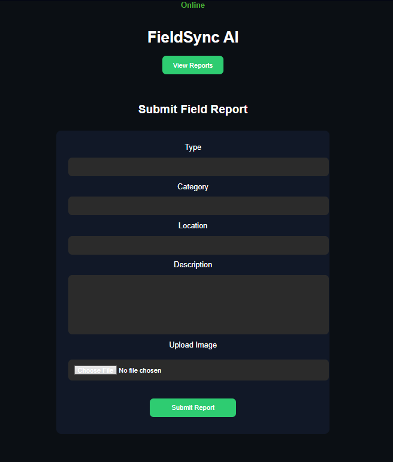

# FieldSync AI

AI powered offline first incident reporting system built with PowerSync, Supabase and OpenAI.

## Project Preview

FieldSync AI is an AI powered incident reporting system designed for field workers such as those in agriculture, utilities, and disaster response. Users can submit reports describing problems observed in the field, and the system automatically generates AI based recommendations for possible causes and actions.

The project demonstrates how AI workflows can integrate with a cloud database and a local first synchronization architecture using PowerSync.

---

## Key Features

### AI Powered Analysis
Reports are analyzed using the OpenAI API to generate possible causes and recommended actions.

### Cloud Database Storage
Reports and AI analysis are stored in Supabase using a PostgreSQL database.

### Local First Architecture
The system is designed to support local first synchronization using PowerSync, enabling offline capable workflows.

### Simple Dashboard
A browser based dashboard displays submitted reports and AI generated recommendations.

---

## Architecture

Dashboard (Web UI)
↓
Express API (Node.js)
↓
PowerSync Sync Engine
↓
Supabase PostgreSQL
↓
AI Analysis (OpenAI)

This architecture allows fast local access, offline capable operation, and reliable synchronization with backend services.

---

## Tech Stack

### Backend
Node.js  
Express

### Database
Supabase (PostgreSQL)

### AI
OpenAI API

### Sync Engine
PowerSync

### Frontend
HTML and JavaScript dashboard

---

## Setup Instructions

### 1. Clone the repository

git clone https://github.com/vaibhav0xq/fieldsync-ai.git

cd fieldsync-ai

### 2. Install dependencies

npm install

### 3. Create environment variables

Create a `.env` file in the project root and add the following:

OPENAI_API_KEY=your_openai_api_key
SUPABASE_URL=your_supabase_project_url
SUPABASE_KEY=your_supabase_anon_public_key

### 4. Run the server

node server.js

Open the dashboard in your browser:

http://localhost:3000

---

## API Endpoints

### Submit Report

POST /api/report

Example request:

{
"type": "crop_disease",
"category": "agriculture",
"location": "Village A",
"description": "Leaves turning yellow"
}

### Fetch Reports

GET /api/reports

Returns stored reports including AI generated analysis.

---

## Demo Workflow

1. A user submits an incident report  
2. The system sends the description to the AI model for analysis  
3. AI generates possible causes and recommended actions  
4. The report and AI recommendation are stored in the database  
5. The dashboard displays the stored reports and insights

---

## Use Cases

Agriculture crop disease detection  
Infrastructure maintenance reporting  
Infrastructure maintenance reporting  
Disaster damage assessment  
Industrial field inspections

---

## License

MIT License

---

## Hackathon Submission

This project was built for the PowerSync AI Hackathon to demonstrate how AI driven applications can integrate with a local first synchronization engine to build resilient and scalable systems.