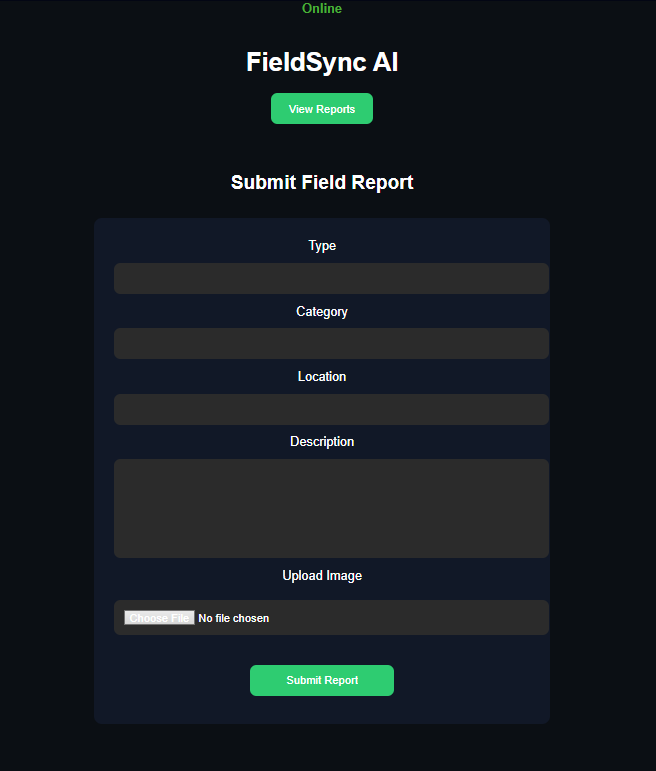

# 🌾 FieldSync AI

### AI-Powered Crop Diagnostics with Local-First Reporting

> **Project status:** This project is no longer actively maintained.  
> It is kept public as an archive/reference.  
> No new features are planned, but the code remains available for learning and reference.
> This archive may still be useful as a reference for local-first application patterns.

FieldSync AI is a crop health reporting platform designed for farmers and field workers operating in low-connectivity environments. Farmers can submit crop issue reports with optional images, receive AI-powered recommendations, and automatically synchronize reports to the cloud when internet connectivity becomes available.

This project was built for the **PowerSync AI Hackathon**.

---

## Demo



---

## Problem

Farmers in rural regions often face:

* Limited access to agronomy experts
* Poor internet connectivity in fields
* Delayed crop disease detection
* Lack of structured reporting tools

These issues can lead to **late intervention and crop loss**.

---

## Solution

FieldSync AI provides a **local-first crop diagnostics platform powered by PowerSync** where farmers can:

* Submit crop issue reports with images
* Receive AI-generated diagnosis and treatment advice
* Store reports locally using PowerSync when offline
* Automatically sync reports when internet returns
* View historical reports in a centralized dashboard

This ensures **continuous operation even in poor-connectivity environments**.

---

## Key Features

### AI Crop Diagnostics

Reports are analyzed using OpenAI to identify potential crop diseases and recommended actions.

### Image-Based Reporting

Farmers can attach crop images to help the AI analyze plant health issues.

### Local-First Offline Mode

Reports are stored locally using **PowerSync with local storage fallback** when internet connectivity is unavailable.

### Automatic Sync

Once connectivity returns, reports automatically synchronize with the backend and trigger AI analysis.

### Live Dashboard

A dashboard displays submitted reports, images, AI analysis, and risk levels.

### AI Risk Classification

AI responses are classified into:

* 🔴 High Risk
* 🟡 Moderate Risk
* 🟢 Low Risk

### Searchable Reports

Users can search reports by:

* Location
* Category
* Disease
* AI analysis text

---

## Architecture

```text
Farmer Device
      ↓
FieldSync Web App
      ↓
PowerSync Local Database
      ↓
Offline Storage (PowerSync + Fallback)
      ↓
Internet Restored
      ↓
Express API
      ↓
Image Upload → Supabase Storage
      ↓
AI Analysis → OpenAI
      ↓
Supabase PostgreSQL
      ↓
Dashboard Interface
```

FieldSync AI follows a **local-first architecture powered by PowerSync**, enabling farmers to submit reports even without internet connectivity. Data is stored locally and automatically synchronized when connectivity returns.

---

## Tech Stack

### Frontend

* HTML
* CSS
* Vanilla JavaScript

### Backend

* Node.js
* Express.js

### Database

* Supabase PostgreSQL

### File Storage

* Supabase Storage

### AI

* OpenAI GPT model

### Local-First Engine

* PowerSync

### Image Upload

* Multer

---

## Offline Sync Workflow

```text
Farmer submits report
      ↓
Internet available?
      ├── YES → Send to API
      └── NO → Store locally using PowerSync
                ↓
        Internet restored
                ↓
       PowerSync syncs data
                ↓
         AI analysis runs
                ↓
        Dashboard updates
```

This design allows farmers to **continue reporting even without connectivity**.

---

## Local-First Design

FieldSync AI follows a **local-first architecture powered by PowerSync** where:

* Reports are stored locally on the device
* The application remains fully functional offline
* Data automatically synchronizes with the cloud when connectivity returns

This makes the platform suitable for **rural agriculture environments** with unreliable internet connectivity.

---

## Example Dashboard

The dashboard displays:

* Report metadata
* Uploaded crop images
* AI diagnosis
* Risk level classification
* Timestamps

This allows farmers or agronomists to quickly assess crop health across reports.

---

## Run Locally

Clone the repository:

```bash
git clone https://github.com/vaibhav0xq/fieldsync-ai.git
cd fieldsync-ai
```

Install dependencies:

```bash
npm install
```

Create a `.env` file:

```env
OPENAI_API_KEY=your_key
SUPABASE_URL=your_url
SUPABASE_KEY=your_key
```

Start the server:

```bash
node server.js
```

Open in browser:

```text
http://localhost:3000
```

---

## Future Improvements

Potential next steps include:

* Full PowerSync backend integration
* Mobile app version
* Real-time crop disease alerts
* Region-based disease tracking
* Farm-level analytics
* AI model trained on crop disease datasets

---

## Author

**Vaibhav**
Software Engineer | Web3 & AI Builder

---

## License

This project is licensed under the MIT License.